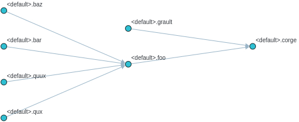
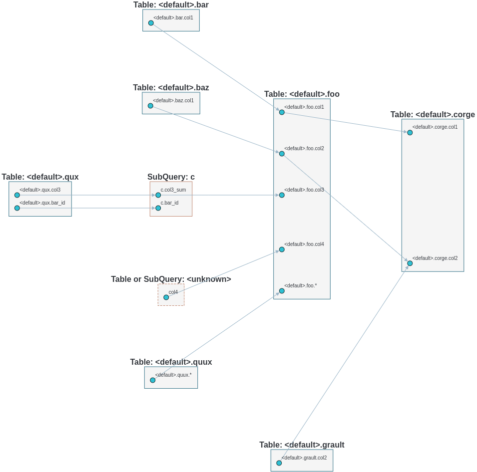

**************
Advanced Usage
**************

Multiple SQL Statements
=======================

Lineage result combined for multiple SQL statements, with intermediate tables identified

.. code-block:: bash

    $ sqllineage -e "insert into db1.table1 select * from db2.table2; insert into db3.table3 select * from db1.table1;"
    Statements(#): 2
    Source Tables:
        db2.table2
    Target Tables:
        db3.table3
    Intermediate Tables:
        db1.table1

Verbose Lineage Result
======================

And if you want to see lineage result for every SQL statement, just toggle verbose option

.. code-block:: bash

    $ sqllineage -v -e "insert into db1.table1 select * from db2.table2; insert into db3.table3 select * from db1.table1;"
    Statement #1: insert into db1.table1 select * from db2.table2;
        table read: [Table: db2.table2]
        table write: [Table: db1.table1]
        table cte: []
        table rename: []
        table drop: []
    Statement #2: insert into db3.table3 select * from db1.table1;
        table read: [Table: db1.table1]
        table write: [Table: db3.table3]
        table cte: []
        table rename: []
        table drop: []
    ==========
    Summary:
    Statements(#): 2
    Source Tables:
        db2.table2
    Target Tables:
        db3.table3
    Intermediate Tables:
        db1.table1

Dialect-Awareness Lineage
=========================
By default, sqllineage doesn't validate your SQL and could give confusing result in case of invalid SQL syntax.
In addition, different SQL dialect has different set of keywords, further weakening sqllineage's capabilities when
keyword used as table name or column name. To reduce the impact, user are strongly encouraged to pass the dialect to
assist the lineage analyzing.

Take below example, `analyze` is a reserved keyword in PostgreSQL. Default non-validating dialect gives incomplete result,
while ansi dialect gives the correct one and postgres dialect tells you this causes syntax error:

.. code-block:: bash

    $ sqllineage -e "insert into analyze select * from foo;"
    Statements(#): 1
    Source Tables:
        <default>.foo
    Target Tables:

    $ sqllineage -e "insert into analyze select * from foo;" --dialect=ansi
    Statements(#): 1
    Source Tables:
        <default>.foo
    Target Tables:
        <default>.analyze

    $ sqllineage -e "insert into analyze select * from foo;" --dialect=postgres
    ...
    sqllineage.exceptions.InvalidSyntaxException: This SQL statement is unparsable, please check potential syntax error for SQL

Use `sqllineage \-\-dialects` to see all available dialects.

Column-Level Lineage
====================

We also support column level lineage in command line interface, set level option to column, all column lineage path
will be printed.

.. code-block:: sql

    INSERT OVERWRITE TABLE foo
    SELECT a.col1,
           b.col1     AS col2,
           c.col3_sum AS col3,
           col4,
           d.*
    FROM bar a
             JOIN baz b
                  ON a.id = b.bar_id
             LEFT JOIN (SELECT bar_id, sum(col3) AS col3_sum
                        FROM qux
                        GROUP BY bar_id) c
                       ON a.id = sq.bar_id
             CROSS JOIN quux d;

    INSERT OVERWRITE TABLE corge
    SELECT a.col1,
           a.col2 + b.col2 AS col2
    FROM foo a
             LEFT JOIN grault b
                  ON a.col1 = b.col1;

Suppose this sql is stored in a file called foo.sql

.. code-block:: bash

    $ sqllineage -f foo.sql -l column
    <default>.corge.col1 <- <default>.foo.col1 <- <default>.bar.col1
    <default>.corge.col2 <- <default>.foo.col2 <- <default>.baz.col1
    <default>.corge.col2 <- <default>.grault.col2
    <default>.foo.* <- <default>.quux.*
    <default>.foo.col3 <- c.col3_sum <- <default>.qux.col3
    <default>.foo.col4 <- col4

Lineage Visualization
=====================

One more cool feature, if you want a graph visualization for the lineage result, toggle graph-visualization option

Still using the above SQL file:

.. code-block:: bash

    sqllineage -g -f foo.sql

A webserver will be started, showing DAG representation of the lineage result in browser.

Table-Level Lineage:

Column-Level Lineage:

